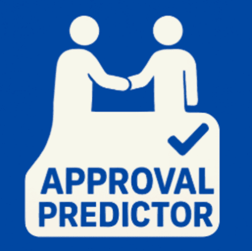

# Approval Predictor - A Predictive Classification Model for Determining Loan Approval Outcomes



Approval Predictor is a machine-learning (ML) project using a publicly available dataset to determine whether a ML pipeline could be built to predict whether a loan application will be approved or rejected. This was achieved by using a classification task, using the `loan_approved` attribute from the dataset as the target and the remaining attributes as features.

## Table of Contents

- [Dataset Content](#dataset-content)
- [Business Requirements](#business-requirements)
- [Hypothesis](#hypothesis)
- [Mapping Business Requirements to Data Visualisation and ML Tasks](#mapping-business-requirements-to-data-visualisation-and-ml-tasks)
- [ML Business Case](#ml-business-case)
- [Epics and User Stories](#epics-and-user-stories)
- [Dashboard Design](#dashboard-design)
- [Technologies Used](#technologies-used)
- [Testing](#testing)
- [Bug Fixes](#bug-fixes-and-unfixed-bugs)
- [Deployment](#deployment)
- [Credits](#credits)
- [Acknowledgements](#acknowledgements)

## Dataset Content

The dataset is sourced from [Kaggle](https://www.kaggle.com/datasets/anishdevedward/loan-approval-dataset/data?select=loan_approval.csv). We created then a fictitious user story where predictive analytics can be applied in a real project in the workplace.

This dataset shows loan applications and approval outcomes for 2,000 individuals. It contains demographic, financial, and employment-related attributes that can be used to predict whether a loan application will be approved or rejected. The data has 8 columns and 2000 rows, this dataset size will be useful as its large enough to hopefully demonstrate patterns in the data and small enough to run quickly in codespace.

**Note**: While the dataset includes `name` and `city` fields, these are excluded from the machine learning model and are fictious. The model only uses anonymised numerical features in the predictive pipeline.

```python
df = pd.read_csv('/kaggle/input/loan-approval-dataset/loan_approval.csv')
```

| Variable          | Meaning                                                        | Units                                                         |
|-------------------|----------------------------------------------------------------|---------------------------------------------------------------|
| name              | Applicant name                                                 | Text for name                                            |
| city              | Applicant's city/location                                      | Text for location (City)                     |
| income            | Applicant's annual income                                      | Dollar amount (30,000 - 150,000)                              |
| credit_score      | Applicant's credit score                                       | Numeric score (300 - 850)                                     |
| loan_amount       | Amount of loan requested                                       | Dollar amount (1,037 - 49,999)                                |
| years_employed    | Number of years with current employer                         | Years (0 - 40)                                                |
| points            | Mortgage discount points paid upfront                         | Points (10 - 100)                                             |
| loan_approved     | Whether loan was approved or not                               | True or False (Target variable)                               |

## Dataset Source and Permissions

This dataset is publicly available on Kaggle under the [loan-approval-dataset](https://www.kaggle.com/datasets/anishdevedward/loan-approval-dataset/data?select=loan_approval.csv) and is free to use for analysis and machine learning projects. The dataset contains loan application data with no personally identifiable information used in the model. The `name` and `city` fields present in the raw dataset are excluded from the machine learning pipeline.

## Project Terms & Jargon

- An **applicant**:  Person who has submitted a loan application to the financial institution.
- An **approved loan**: Loan application that has been accepted and will receive funding.
- A **rejected loan**: Loan application that has been rejected and has been denied for funding.
- **Credit score**: Numerical representation of an applicant's creditworthiness.
- **Points**: Mortgage points are fees paid upfront to reduce the interest rate on a loan. One point equals 1% of the loan amount.
- **Years employed**: The length of time an applicant has been with their current employer, which is used to assess employment stability.
- **Loan-to-income ratio(LTI)**: Compares the loan amount to the applicant's income. This helps assess risk and affordability.


## Business Requirements

The client is a fictitious financial institution that processes a large number of loan applications daily. Manual review of loan applications is time-consuming and resource-intensive. The institution wants to understand what factors contribute most to loan approval decisions and whether loan approvals can be accurately predicted to streamline operations and improve risk assessment.

**Business Requirement 1** - The client is interested in determining which applicant variables are most strongly correlated with the loan approval outcome. They want a ranked list of variables to be provided based on their relevance and impact.

**Business Requirement 2** - The client aims to offer a guide for potential applicants by identifying the influential factors that contribute to loan approval. These insights will be used to recommend specific improvements for applicants and guide them to increase their chances of having a loan approved.

## Hypothesis and how to validate?

The client wants to know whether the data supports the following hypotheses:

- **Hypothesis 1**: Applicants with higher credit scores tend to have higher approval rates.
- Validation: A correlation analysis that indicates a strong relationship between credit score and the target loan_approved.
- **Hypothesis 2**: Applicants who have been employed longer have higher approval rates than those with shorter employment history.
- Validation: A correlation study that measures the relationship between years employed and loan approval outcomes.
- **Hypothesis 3**: Applications with higher loan amounts relative to income (LTI ratio) have lower approval rates.
- Validation: Analysis of the loan-to-income ratio feature, created as a new feature (loan_amount / income), and its correlation with approval outcomes.

- **Null Hypothesis**
-There is no significant relationship between applicant features and loan approval outcomes. Approval decisions cannot be predicted from these features due to insufficient data.

[Back to top](#approval-predictor---a-predictive-classification-model-for-determining-loan-approval-outcomes)

## Mapping Business Requirements to Data Visualisation and ML Tasks

### Business Requirement 1: Data Visualisation and Correlation study

- We will inspect the data related to the applicant base.
- We will conduct a correlation study (Pearson and Spearman) to understand better how the variables are correlated to loan approval.
- We will plot the main variables against loan approval to visualise insights.
- We will analyse approval patterns by income ranges, point ranges, credit score ranges, loan amounts, employment history, and loan-to-income ratios.
- This will be carried out during the Data Visualisation, Cleaning, and Preparation.

### Business Requirement 2: Classification Model

- We need to predict whether a loan application will be approved or not.
- Therefore we need to build a binary classification model.
- A machine learning pipeline will be able to map the relationships between the features and target.
- Hyperparameter optimisation will give us the best chance at a highly accurate prediction.
- The model will provide actionable guidance to applicants on how to improve their approval odds.
- This will be carried out during the Model Training and Optimisation.

### Rationale to Map Business Requirements to Data Visualisations and ML Tasks
The mapping of business requirements to specific tasks was determined through the following rationale:

**For Business Requirement 1 (Feature Correlation Analysis):**
- Data visualisation and correlation studies are the first steps to understand which features drive loan approval decisions before building the predictive model.
- Pearson and Spearman correlation analyses provide measures of feature relationships, addressing the user need for a "ranked list of variables."
- Visual plots (histograms, boxplots, heatmaps) make patterns accessible to both technical and non-technical stakeholders.
- The exploratory analysis directly answers "which variables are most strongly correlated" before committing to a specific ML approach.

**For Business Requirement 2 (Classification Model):**
- Binary classification is the appropriate ML task because the target variable (`loan_approved`) has exactly two classes (approved/rejected).
- A supervised learning approach is required since we have historical approval data with known outcomes to learn from.
- A machine learning pipeline ensures reproducible preprocessing and model training.
- Hyperparameter optimisation is necessary to meet the 80%+ precision and recall success metrics defined in the business case.
- The model's probability outputs enable actionable guidance by showing applicants how feature changes affect approval odds.

[Back to top](#approval-predictor---a-predictive-classification-model-for-determining-loan-approval-outcomes)

## ML Business Case

We want an ML model to predict whether a loan application will be approved based upon previously gathered loan application data. The target variable, `loan_approved`, is categorical and contains two classes: 0 (not approved) and 1 (approved).

We will consider a classification model, a supervised model with a two-class, single-label output that matches the target.

Our ideal outcome is to provide our loan officers with reliable insight into processing applications with higher accuracy and efficiency.

**The model success metrics are:**
- At least 80% Recall for Approved, on train and test sets
- At least 80% Precision for Approved, on train and test sets

**The model will be considered a failure if:**
- The model fails to achieve 80% recall for approved class
- The model fails to achieve 80% precision for approved class

The model output will be a flag, that indicaties if an applicant will be approved or not and the associated probability of approval.

**The training data to fit the model comes from:** [Kaggle](https://www.kaggle.com/datasets/anishdevedward/loan-approval-dataset/data?select=loan_approval.csv)

**The dataset contains:** 2,000 observations and 8 attributes.

**Target:** `loan_approved`; **Features:** `credit_score`, `income`, `loan_amount`, `years_employed`, `loan_to_income` (derived feature).

**Note:** The `points` feature was excluded from the final model despite its perfect correlation, as it creates unrealistic predictions and doesn't provide actionable guidance to applicants.

[Back to top](#approval-predictor---a-predictive-classification-model-for-determining-loan-approval-outcomes)

## Epics and User Stories

The project was split into 5 Epics based upon the Data Visualisation and Machine Learning tasks.

### Epic - Information Gathering and Data Collection

- **User Story** - As a data analyst, I can import the dataset from Kaggle so that I can save the data in a local directory.
- **User Story** - As a data analyst, I can load a saved dataset so that I can analyse the data to gain insights.

### Epic - Data Visualisation, Cleaning, and Preparation

- **User Story** - As a data scientist, I can visualise the dataset so that I can interpret which attributes correlate most closely with loan approval (Business Requirement 1).
- **User Story** - As a data analyst, I can evaluate the dataset to determine what data cleaning tasks need to be carried out.
- **User Story** - As a data analyst, I can identify and remove redundant features that have no predictive value.
- **User Story** - As a data analyst, I can determine whether the target requires balancing in order to ensure the ML is not fed imbalanced data.
- **User Story** - As a data scientist, I can carry out feature engineering to create the loan-to-income ratio feature for the ML model.

### Epic - Model Training, Optimisation and Validation

- **User Story** - As a data scientist, I can split the data into a train and test set to prepare it for the ML model.
- **User Story** - As a data engineer, I can fit a ML pipeline with all the data to prepare the ML model for deployment.
- **User Story** - As a data engineer, I can determine the best algorithm for predicting loan approval to use in the ML model (Business Requirement 2).
- **User Story** - As a data engineer, I can carry out hyperparameter optimisation to ensure the ML model gives the best results (Business Requirement 2).
- **User Story** - As a data scientist, I can determine the best features from the ML pipeline to determine whether the ML model can be optimised further (Business Requirement 2).
- **User Story** - As a data scientist, I can evaluate the ML model's performance to determine whether it can successfully predict loan approval (Business Requirement 2).

### Epic - Dashboard Planning, Designing, and Development

- **User Story** - As a non-technical user, I can view a project summary that describes the project, dataset and business requirements to understand the project at a glance.
- **User Story** - As a non-technical user, I can view the project hypotheses and validations to determine what the project was trying to achieve and whether it was successful.
- **User Story** - As a non-technical user, I can enter unseen data into the model and receive a prediction (Business Requirement 2).
- **User Story** - As a technical user, I can view the correlation analysis to see how the outcomes were reached (Business Requirement 1).
- **User Story** - As a technical user, I can view all the data to understand the model performance (Business Requirement 2).
- **User Story** - As a non-technical user, I can view the project conclusions to see whether the model was successful and if the business requirements were met.

### Epic - Dashboard Deployment and Release

- **User Story** - As a user, I can view the project dashboard on a live deployed website (Heroku).
- **User Story** - As a technical user, I can follow instructions in the readme to fork the repository and deploy the project for myself.

## Dashboard Design

Page 1: Quick Project Summary
- Quick summary of the Approval Prediction project.
- Description of the datasetand its source.
- State the business requirements:
- Build a model to predict loan approval with 80%+ precision and recall.
- Provide actionable insights to help applicants improve their approval odds.

Page 2: Feature Impact Study
- Business requirement addressed: Analyse a model that uses the points feature.
- Before analysis we expected this page to highlight a high level of accuracy achieved with points.
- After analysis, the page shows:
- Business requirement 1 results using the points-driven model.
- Checkbox: Explore dataset shape and preview records.
- Highlight that points has 100% feature importance.
- Checkbox: Plots showing approval split by points threshold.
- Checkbox: Parallel plot comparing points vs other features.

Page 3: Approval Predictor (Without Points)
- Business requirement addressed: Provide a reliable prediction tool using applicant features only.
- Input widgets for applicant profile:
- Credit score, income, loan amount and years employed.
- “Run Predictive Analysis” button:
- Sends values to the optimised LogisticRegression pipeline.
- Predicts approval outcome and associated probability.
- Provides tailored guidance based on feature contributions (e.g., “Increase credit score above X”).
- Provides the loan_to_income value and provides a risk band.

Page 4: Project Hypotheses and Findings
- Before analysis, we listed hypotheses to validate. After analysis, we can report:
- Applicants with higher points always get approved.
- Confirmed: points feature dominates approval decisions.
- Approval probability is predictable using others features and removing points.
- Confirmed in Notebook 06: credit_score, loan_to_income, and income drive final predictions.
- Confirmed: Final model gives 87% recall / 86% precision with actionable insights.

Page 5: Final ML Model (Without Points)
- Key takeaways after training the final pipeline (Notebook 06).
- ML pipeline steps:
- BoxCox transformation (loan_to_income only).
- Robust scaling.
- LogisticRegression (C=0.1, penalty=l2, class_weight=None).
- Feature importance chart showing:
- credit_score, loan_to_income, income, years_employed, loan_amount.
- Pipeline performance metrics:
- Train and test sets.

## Technologies Used

The technologies used throughout the development are listed below:

### Languages
- **Python** - Primary programming language for data analysis and machine learning

### Python Packages
- **Pandas** - Open source library for data manipulation and analysis
- **NumPy** - 
- **YData Profiling** - 
- **Matplotlib** - 
- **Seaborn** - 
- **Plotly** - 
- **Feature-engine** -
- **ppscore** - 
- **scikit-learn** - 

### Other Technologies
- **Git** - For version control
- **GitHub** - Code repository
- **Heroku** - For application deployment
- **Jupyter Notebooks** - For exploratory data analysis and model development

[Back to top](#approval-predictor---a-predictive-classification-model-for-determining-loan-approval-outcomes)

## Testing

### Manual Testing

#### User Story Testing

**Dashboard Testing**: This was manually tested using user stories. All pages were tested for responsiveness and functioned as intended for all pages on mobile, tablets and desktop sizes. The sidebar highlights the active page and takes the user to each page as intended.

**Jupyter Notebook Testing**: All Jupyter notebooks used during the project were tested individually. Each notebook executed successfully from start to finish without errors, and all cells produced the expected outputs. This confirms that the data processing, feature engineering, model training workflows, and visualisations behave as intended.

<br>

**As a non-technical user, I can access a project summary that explains the dataset and business requirements, giving me an overview of the project.**

| Feature | Action | Expected Result | Actual Result |
|---------|--------|----------------|---------------|
| Project summary page | Open the summary page | Page loads correctly and all sections are accessible | Functions as intended |
| README link | Click the link to GitHub README | Opens the correct GitHub page in a new tab | Functions as intended |
| Text formatting | Check bold text, headers and bullet lists | All formatting displays correctly in Streamlit | Functions as intended |

<br>
<br>

**As a non-technical user, I can review the project hypotheses and their validation results to understand the goals of the analysis and whether they were achieved.**

| Feature | Action | Expected Result | Actual Result |
|---------|--------|----------------|---------------|
| Project findings page | Navigate to page | Selecting the page from the sidebar opens it correctly | Functions as intended |
| Text formatting | Check bold text, headers and bullet lists | All formatting displays correctly in Streamlit | Functions as intended |

<br>
<br>

**As a non-technical user, I can input my own data into the model and receive a loan approval prediction, fulfilling Business Requirement 2.**

| Feature | Action | Expected Result | Actual Result |
|---------|--------|----------------|---------------|
| Prediction page | Navigate to page | Clicking on navbar link in sidebar navigates to correct page | Functions as intended |
| Enter live data | Interact with widgets | All widgets are interactive, respond to user input | Functions as intended |
| Live prediction | Click on 'Run Predictive Analysis' button | Clicking on button displays message on page with prediction and % chance | Functions as intended |
| Input validation | Enter zero income | Error message displayed stating value must be greater or equal to 30,053 | Functions as intended |
| Input validation | Enter zero requested loan amount | Error message displayed stating value must be greater or equal to 1022 | Functions as intended |
| Input validation | Enter zero credit score | Error message displayed stating value must be greater or equal to 300 | Functions as intended |
| Input validation | Enter 41 years employed | Error message displayed stating value must be less than or equal to 40 | Functions as intended |
| High risk and high loan-to-income(LTI) ratio | Enter lowest value for income, credit score and years employed and highest value for loan amount | Provided guidance of 100.0% probability that this applicant will not be approved, with a 1.66 LTI and high risk band | Functions as intended |
|  Moderate risk and moderate loan-to-income(LTI) ratio | Enter middle value for income, credit score, years employed and loan amount | Provided guidance of a 0.33 LTI and moderate risk band | Functions as intended |
| Low risk and low loan-to-income(LTI) ratio | Enter highest value for income, credit score and years employed and lowest value for loan amount | Provided guidance of 100.0% probability that this applicant will be approved, with a 0.01 LTI and low risk band | Functions as intended |

<br>
<br>

**As a technical user, I can explore the correlation analysis to understand how different features influence loan approval and how the model’s insights were derived.**

| Feature | Action | Expected Result | Actual Result |
|---------|--------|----------------|---------------|
| Correlation Study page | Navigate to page | Clicking on navbar link in sidebar navigates to correct page | Functions as intended |
| Correlation data | View correlation results | Correlation data is displayed on dashboard | Functions as intended |
| Feature distributions | View numerical feature plots | Plots are displayed showing distributions by approval status | Functions as intended |
| Parallel Plot | View parallel categories plot | Parallel plot is displayed on dashboard, is interactive | Functions as intended |


<br>
<br>


**As a technical user, I can view detailed model performance metrics and supporting statistics so that I can evaluate how well the model predicts loan approval (Business Requirement 2).**

| Feature | Action | Expected Result | Actual Result |
|---------|--------|----------------|---------------|
| Model performance page | Navigate to page | Clicking on navbar link in sidebar navigates to correct page | Functions as intended |
| Success metrics | View page | Success metrics outlined in business case are displayed | Functions as intended |
| Feature Importance | View page | Most important features are plotted and displayed | Functions as intended |
| Model Performance | View page | Confusion matrix for train and test sets are displayed | Functions as intended |

<br>

### Validation Testing

I used the [CI Python Linter](https://pep8ci.herokuapp.com/#) and followed the [PEP8 guidelines](https://peps.python.org/pep-0008/) to validate my code.

The following pages where reviewed and edited using the linting process:
- all files in the folder app_pages
- all files in the folder jupyter notebooks
- all files in the src folder
- app.py

The main fixes were:
- Removing trailing whitespace and blank lines with spaces
- Breaking up long lines to meet the 79-character limit
- Fixing indentation errors
- Adding missing whitespace around operators and commas
- Correcting continuation line indentation in multi-line statements
- Ensuring two blank lines before function definitions
- Removing duplicated imports and following PEP8 import ordering

[Back to top](#approval-predictor---a-predictive-classification-model-for-determining-loan-approval-outcomes)

## Bug Fixes and Unfixed Bugs
There were no unresolved bugs to my knowledge after manual testing.
Please see the following bug fixes below:
1. Kaggle ZIP Extraction Command Overwrite Issue
- Fix: I added -o to ! unzip {DestinationFolder}/*.zip -d {DestinationFolder} due to csv file already existing and causing overwrite prompts.
2. ValueError: Could not interpret value 'loan_to_income' for 'x'
- Bug: The function plot_numerical() referenced loan_to_income before it was created.
- Fix: Added the calculation earlier in the workflow: df['loan_to_income'] = df['loan_amount'] / df['income']
3. load_pkl_file Not Defined
- Bug: This occurred because the import failed when src.data_management attempted to use a Streamlit cache decorator before Streamlit was initialised.
- Fix: Corrected import to reference the src module
4. ModuleNotFoundError: No module named 'data_management'
- Bug: Caused by referencing the module without the src. prefix
- Fix: Updated import path to include src.data_management
5. TypeError: tuple indices must be integers or slices
- Bug: Caused by a trailing comma that turned the radio widget return into a tuple
- Fix: Removed the comma
6. Streamlit pages approval predictor and feature impact showed some blank information
- Fix: Added error handling, removed .filter() from both pages and comma on multipage so page becomes a dictionary.
7. Heroku Deployment Failure (Wrong Entry File)
- Bug: The application failed to deploy on Heroku because the Procfile referenced app.py, but the file was mistakenly named apps.py
- Fix: Renamed apps.py to app.py to match Procfile.

[Back to top](#approval-predictor---a-predictive-classification-model-for-determining-loan-approval-outcomes)

## Deployment
### Heroku

* The App live link is: [Approval Predictor](https://approvalpredictor-09300f76f3c7.herokuapp.com/)

To deploy the Heroku app i followed the following steps:

1. Add setup.sh to the working directory with the following code:
```
mkdir -p ~/.streamlit/
echo "\
[server]\n\
headless = true\n\
port = $PORT\n\
enableCORS = false\n\
\n\
" > ~/.streamlit/config.toml
```
2. Set the runtime.txt Python version to a [Heroku-24](https://devcenter.heroku.com/articles/python-support#supported-runtimes) stack currently supported version(```python-3.12.1```)
3. Add a Procfile to the working directory with the following code:
```
web: sh setup.sh && streamlit run app.py
```
4. Log in to Heroku and create an App.
2. At the Deploy tab, select GitHub as the deployment method.
3. Select your repository name and click Search. Once it is found, click Connect.
4. Select the branch you want to deploy, then click Deploy Branch.
5. The deployment process should happen smoothly if all deployment files are fully functional. Click now the button Open App on the top of the page to access your App.
6. If the slug size is too large then add large files not required for the app to the .slugignore file.
7. Troubleshoot any build errors by reviewing the build log.

## Forking
If you wish to fork this repository, please follow the instructions below:

1. On the main repository page, click the Fork button in the top-right corner.
2. Choose the desired Owner for the fork from the dropdown menu.
3. (Optional) Rename the repository if you want to differentiate it from the original.
4. (Optional) Add a description to explain the purpose of your fork.
5. Ensure “Copy the main branch only” is checked.
6. Click Create fork to complete the process.

## Cloning
To clone this repository to your local machine:

1. On the main repository page, click the Code button.
2. Copy the HTTPS URL provided.
3. Open your terminal and navigate to the directory where you want the repository to be saved.
4. Run the command: git clone <paste-the-copied-URL>
5. Press Enter to clone the repository into your selected location.

### Installing Requirements

The requirements.txt file contains only the packages required for deploying the dashboard to Heroku, due to Heroku’s slug size limitations.

To install all dependencies needed for full local development and notebook execution, run the following command in your terminal:

```pip install -r all-requirements.txt```

[Back to top](#approval-predictor---a-predictive-classification-model-for-determining-loan-approval-outcomes)

## Credits 

### Content 

- [Streamlit Status API](https://docs.streamlit.io/develop/api-reference/status) for markdown for error handling.
- [Streamlit ProgressColumn](https://docs.streamlit.io/develop/api-reference/data/st.column_config/st.column_config.progresscolumn?utm_source=streamlit.) for progress column.
- [Robust Scaling Techniques](https://www.geeksforgeeks.org/machine-learning/standardscaler-minmaxscaler-and-robustscaler-techniques-ml/) - robust scaling
- [AdaBoostClassifier Parameters](https://scikit-learn.org/stable/modules/generated/sklearn.ensemble.AdaBoostClassifier.html) - Parameter definitions for AdaBoostClassifier
- [RandomForestClassifier Parameters](https://scikit-learn.org/stable/modules/generated/sklearn.ensemble.RandomForestClassifier.html) - Parameter definitions for RandomForestClassifier
- [Random Forest Algorithm](https://builtin.com/data-science/random-forest-algorithm) - Random Forest algorithm explanation
- [XGBClassifier Parameters](https://xgboost.readthedocs.io/en/stable/parameter.html) - Parameter definitions for XGBClassifier
- [LogisticRegression Parameters](https://scikit-learn.org/stable/modules/generated/sklearn.linear_model.LogisticRegression.html) - Parameter definitions for LogisticRegression
- Code used in the exploratory data analysis notebook for the histogram and box plots were taken from the Code Institute "Churnometer" walkthrough project.
- Code used in the exploratory data analysis notebook for the PPS heatmap function was taken from the Code Institute "Exploratory Data Analysis Tools" module.
- Custom function used in the data cleaning notebook for checking the effect of data cleaning on distribution was taken from the Code Institute "Data Analytics Packages - ML: feature-engine" module.
- Custom function used in the feature engineering notebook for analysing transformations was taken from the Code Institute "Data Analytics Packages - ML: feature-engine" module.
- Custom function used in Evaluation notebook and hyperparameter optimisation notebook was taken from the Code Institute "Data Analytics Packages - ML: Scikit-learn" module.
- Custom function for displaying the confusion matrix and analysing model performance used in Evaluation notebook and hyperparameter optimisation notebook was taken from the Code Institute "Data Analytics Packages - ML: Scikit-learn" module.
* The multi-page class was taken from the Code Institute "Data Analysis & Machine Learning Toolkit".

### Media

- [IQR Method Tutorial](https://www.youtube.com/shorts/SH7TPbT6zqE) - YouTube video to work out Interquartile Range(IQR).
- [Canvas](https://www.canva.com/design/DAG5jktwhGg/i6nhfKbVFhhxyLw-PvU4pA/edit?continue_in_browser=true&ui=eyJFIjp7IkE_IjoiViIsIkEiOiJ1cGxvYWRfZjk0MzBiNGItY2ZjNi00NDQ2LTk3ZmItN2Q2ZGFlNDZiM2Y1IiwiQiI6IkIifSwiRyI6eyJCIjp0cnVlLCJWIjp0cnVlfX0) - Logo design, README banner image
- [Image Resizer](https://imageresizer.com/) -  to convert the readme banner into a png file.

## Acknowledgements
* I would like to thank my mentor, Mo Shami, for his guidance and support throughout this project. His feedback helped strengthen the validation of my hypotheses within the Streamlit app, and our discussions around machine learning provided valuable direction and insight. His experience and advice were truly invaluable.
* I would like to thank my partner and family for their unwavering support during this project.
* I woud like to thank tutor support and the discord group for data analytics. Tom helped with early problems when installing requirements.txt and the discord group provided advice around the slugignore file.